# VacBlocks
*A vaccination smart contract*

## Introduction
Welcome to VacBlocks! 

This project aims to demonstrate how vaccinations can be tracked on the blockchain. 

You may [interact with the smart contract here!](https://vacblocks.glitch.me/)  

>⚠️ READ THIS FIRST
>
> This contract is deployed on Goerli testnet,  
> so use only Goerli ETH (not real ETH) and use fake input data.  
> Some input fields have been pre-filled, use those!

## Interacting With The Smart Contract
The following sections will give a surface level overview of the smart contract via an interactive user interface.

### Ideal-Case Scenario
A simple use-case scenario of Vacblocks involves three parties, each having their own wallet address:
- User: `0x9804763714fba25B0a2E071dc8c0DC7c338DdF00`
- Clinic #1: `0x6094504b2C61125A3a8fb799a79d769acD406f28`
- Validator #1: `0x9Bea632b94fef8130F7094C8B69D90dF75357335`

Assume that the user goes to the Clinic #1 to get vaccinated and registers their vaccination on the blockchain.

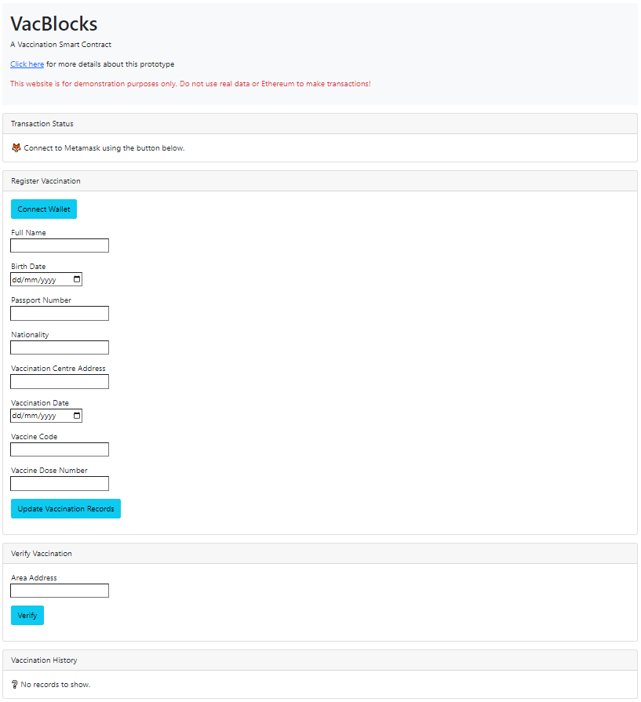

The user would have to connect their wallet to the registration page.

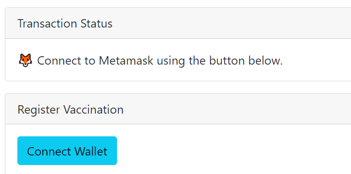
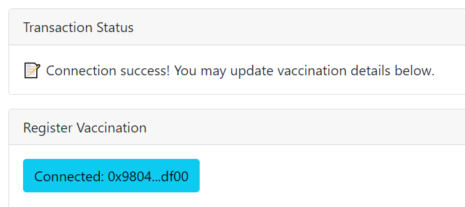

Notice that the user's vaccination history is currently empty, since it is the first time this wallet address is registering data onto the blockchain.

<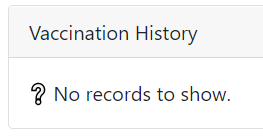

The user can proceed to fill in their vaccination details. 

The user must include the wallet address of the clinic they were vaccinated at.

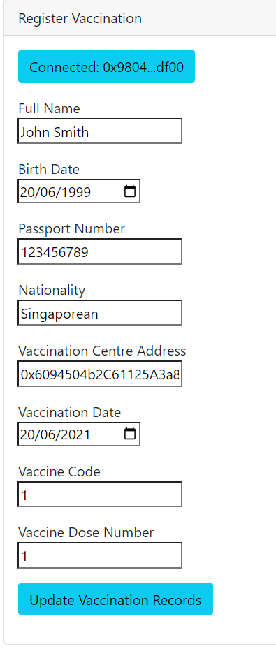

Upon clicking "Update Vaccination Records", the user will be prompted to approve and send transaction.

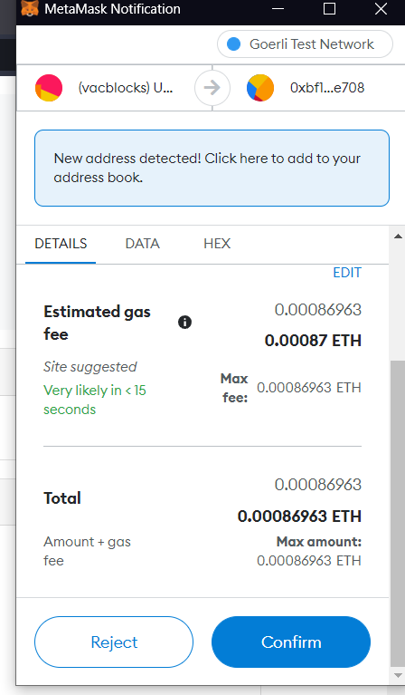

After a while, the user's vaccination history will be updated

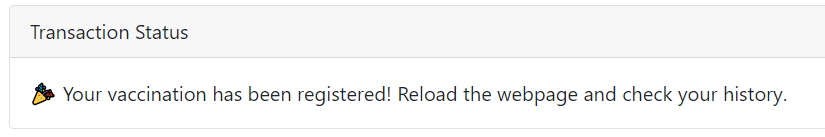

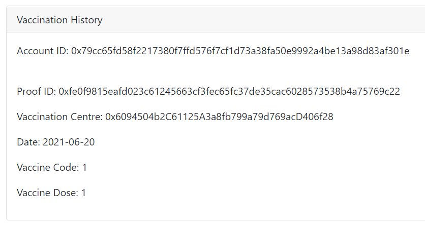

Asssume the user is now elgible to enter a public event that requires attendees to be vaccinated. 

For this event, the validator address described above is used by the staff to check if an attendee has met the vaccination rules.

While the user is connected to the verification page, they will have to enter the validator address of the event.

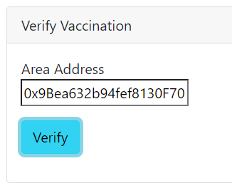

Upon clicking verify, we can further confirm that the user has met vaccination rules for the event.

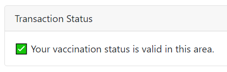

### "Fail" Scenarios
There are several instances where a user would encounter errors when interacting with the smart contract.

Assume the following the following parties and their wallet addresses:
- Clinic #2: `0x91d0dc68DEd75Ab394afeF693524C8E6E13852Ab`
- Validator #2: `0xf41f3950A1884Be53DEA882668A9637894dDEd35`

Clinc #2 is an unverified clinic (not registered on the blockchain).

Validator #2 consists of a different set of vaccination rules for a different event.

If the same user tries to register a vaccination from Clinic #2, an error message is returned.

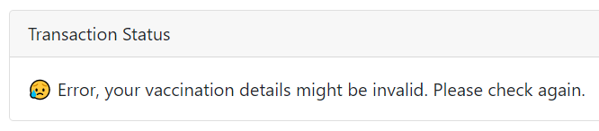

Likewise when the user does not meet the rules set by Validator #2

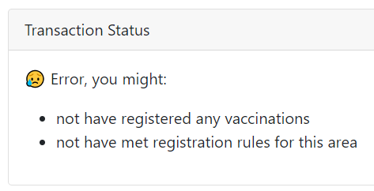

### How About The Vaccination Centre And Validator?
These two contracts were deployed alongside the main vaccination registry contract.

I wrote data onto the blockchain for these two contracts "behind the scenes" via Etherscan

There are other ways to do this too, for instance Remix IDE or Truffle. I used Etherscan just to experience the process of verifying smart contracts.

### Other Features
For the purposes of this project, MetaMask ensures that the user is connected to Goerli testnet. This is characteristic of DeFi apps that are available in specific networks (Ethereum, BSC etc.). Below shows the case if a user switched to Ropsten testnet.

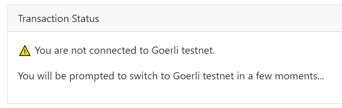
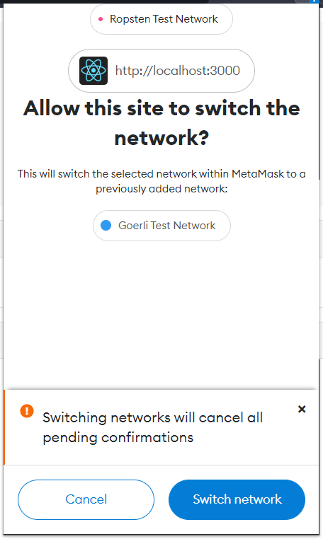

## The Smart Contract
This section will go through the motivations for storing vaccination records on the blockchain.

Vacblocks uses three [key features of blockchain technology](https://www.geeksforgeeks.org/features-of-blockchain/):
- Security
- Psuedo-anonymity
- Transparency

### Security
The registration of vaccination, clinic and requirements are transactions that are cryptographically hashed, stored and linked on the blockchain. Modifying data means to change all hashes that link each block of transactions, making it almost impossible to tamper.

### Psuedo-anonymity
Each user can only use their wallet addresses to access vaccination details, and in order to use their wallet address, they require a secret key.

Not only that, the data that the user enters when registering vaccination details are hashed before storage on the blockchain. 

It would be difficult to figure out the true identity of users just from reading blockchain data alone. 

For individuals, it is nice knowing that personal data is not easily revealed. 

On a political level, it may provide a way for countries to share verified information of their citizens, without revealing much data.

### Transparency

Different countries have varying standards and levels of robustness when it comes to data management. 

The transparency of rules and data management through a smart contract fosters collaboration between parties and avoids unnecessary biases.

## Implementation

The following tools were used to create the smart contract and front-end for this project:
- **Truffle** - writing smart contract and tests
- **Ganache** - set up a local blockchain to test smart contract
- **Remix IDE** - further testing of smart contract
- **Alchemy** - create blockchain node to deploy smart contract on Goerli testnet and provide API for smart contract interaction
- **Etherscan** - to view transaction statuses
- **React.js** - create front-end

The solidity code written for the smart contract was inspired by [this article](https://medium.com/techtale/trackvac-track-covid-19-vaccination-on-blockchain-bb0d492d66d4). Then I adapted the code to include other features.

## Project Reflections

### Difficulties Faced

- Testing the smart contract. There are many test-cases to consider and often times there are those caught me offguard.
- Interacting with the smart contract via APIs in React. I sort of had to draw a "mental map" of how different components worked with one another and how best to display them onto the user interface.

### Things I Would Improve 
- Separate interfaces for users, vaccination centre and validators. [This repository](https://github.com/jiunnhwa/BlockChainVaccCertTracker) provides a more familiar vaccination user interface
- An initial idea I had was to have a one time password (OTP) mechanism for verfication

### How Will The Project Concept Fare In The Real World?

This project is merely a proof-of-concept and is not robust enough to be implemented operationally.

The ideal conditions for real world vaccination smart contract would require active participation by governments, 3rd party organisations and individuals to maintain the blockchain nodes that store data.

A degree of centralisation is still required though. Governments need to make sure that legitimate vaccination records are stored on the blockchain. The process of storing data on the blockchain also needs to be accessible, an not everyone is familiar with using decentralised services.

Furthermore, discussions would have to be made regarding the blockchain network the smart contract would be deployed on. If it were to be deployed on Ethereum, should users be liable for transaction costs?

